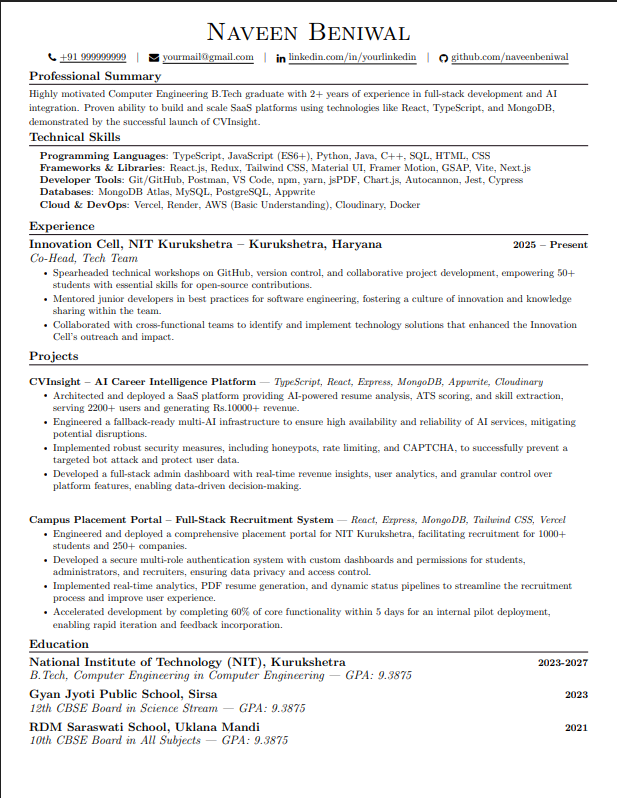
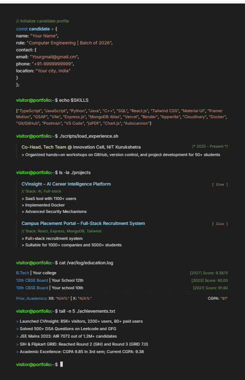
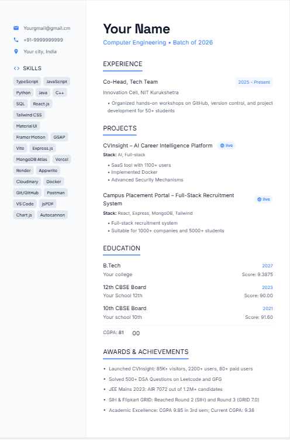
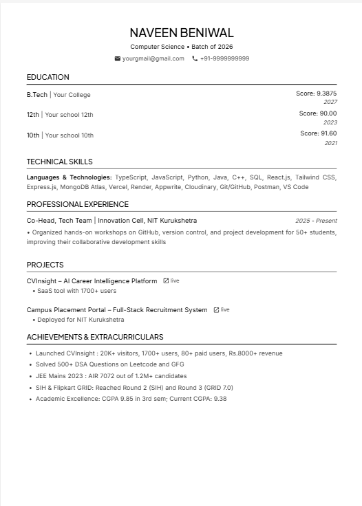
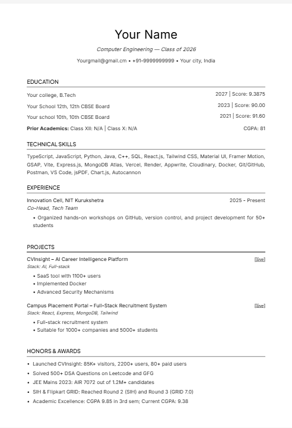

  <h1>ATS-Friendly Software Engineer Resume Templates</h1>

  
  
  

  
<i>A collection of highly-optimized, 1-page LaTeX resume formats engineered for ATS readability.</i>

As a fellow student navigating the placement grind, I noticed a recurring problem: many deserving candidates were getting auto-rejected simply because their resumes couldn't be parsed properly by Applicant Tracking Systems (ATS). 

After diving deep into how the recruitment process actually works from the inside, I engineered these templates to solve that problem. They are built to perfectly balance strict ATS readability with the clean, modern aesthetic that human recruiters actually want to see.

---

### 🏆 The Open Source Template: The Apex Resume
This is the universally accepted, highly ATS-optimized template. It is stripped of all the bad formatting that breaks parsers, but keeps a highly structured, professional look. It is a bulletproof format for applying to almost any tech company.

* **Instant Edit:** [Click here to Clone the Overleaf Project](https://www.overleaf.com/read/jnwsqjbgsxzc#525100)
* **Manual File:** See the `apex_resume.tex` file in this repository.

  

---

### ⚡ Why Format Matters: The Tool I Built to Help
Many off-campus applications fail the initial screening purely because of poor structure. 

To help solve this without forcing everyone to learn LaTeX, I built a free tool called **CVInsight**. The image below shows a typical "Before" resume versus the output from the tool. CVInsight automatically handles the formatting and uses AI to help tailor your bullet points to specific job descriptions, significantly boosting your ATS compatibility.

  

---

### 📁 Want More Designs? (No LaTeX Required)
If you don't want to fight with LaTeX compiler errors or margins, you can use the tool to generate the 4 premium templates below instantly using plain English for **Free**. Auto-fill your details, check your ATS Score, and download your 1-page PDF instantly at **[CVInsight.me](https://www.cvinsight.me)**.

> **Note:** These are **Platform Exclusives**. The raw LaTeX code is not in this repository, but you can generate them as 1-click PDFs directly on the site.

####  1. The Creative Template (Platform Exclusive)
**Why use this?**
A dark-mode, monospaced layout stylized to look exactly like a code editor or Bash terminal. It is a fun way to present yourself in an interview, making you look completely different from the rest of the stack.
* ** Best For:** Backend Engineers, DevOps, Cybersecurity, Hackathons, and Web3 startups.

  

####  2. The Modern Template (Platform Exclusive)
**Why use this?**
A sleek 30/70 two-column layout that separates fast-facts (skills, contact) from deep-dives (experience, projects) for easy scanning.
* ** Best For:** Frontend Developers, UI/UX Designers, Product Managers, and modern Tech Startups.

  

####  3. The Professional Template (Platform Exclusive)
**Why use this?**
A highly optimized, single-column 'Wall of Text' layout designed to easily pass strict ATS scanners with zero wasted space.
* ** Best For:** FAANG, Finance, Corporate Roles, and traditional engineering campus placements.

  

####  4. The Minimalist Template (Platform Exclusive)
**Why use this?**
A purely typography-driven, serif-font template inspired by classic academic LaTeX formatting.
* ** Best For:** Masters/PhD applications, Research & Development (R&D), Data Science, and Quantitative fields.

  

👉 **[Click here to generate these resumes instantly as PDFs at CVInsight.me](https://www.cvinsight.me)**

---
⭐ **If you found the Apex template or the tool helpful for your placements, please drop a star on this repository!** ⭐
